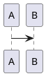

Inline `code` and `let x = 1`.

```ts
function add(a: number, b: number): number {
  return a + b;
}
```

```python
print("hi")
```


```mermaid
graph TD; A-->B
```


```plantuml
@startuml
A -> B
@enduml
```
